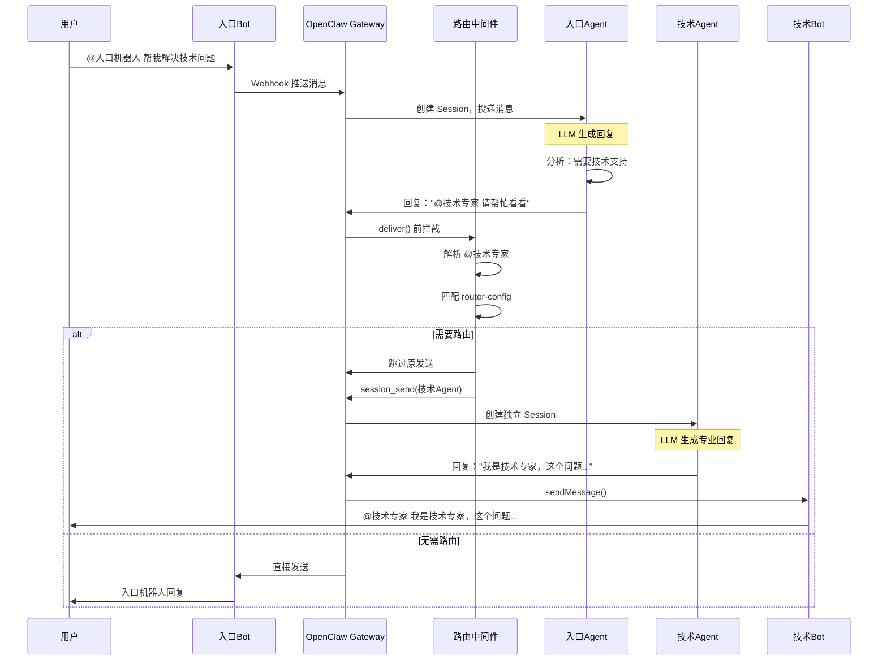
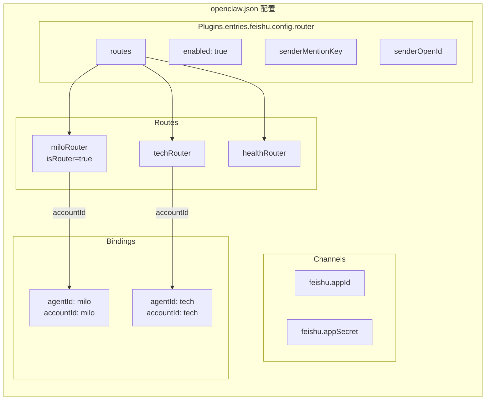

# OpenClaw 多 Agent 协作架构图

## 1. 整体系统架构

```mermaid
graph TB
    subgraph "飞书群聊"
        User[用户]
    end

    subgraph "OpenClaw Gateway"
        direction TB
        
        subgraph "Channel Layer"
            FeishuChannel[飞书 Channel<br/>extensions/feishu]
        end
        
        subgraph "Router Layer"
            RouterMiddleware[消息路由中间件<br/>router-middleware.ts]
            MentionParser[@提及解析器<br/>mention.ts]
        end
        
        subgraph "Agent Layer"
            Agent1[Agent: 入口机器人<br/>isRouter=true]
            Agent2[Agent: 技术专家]
            Agent3[Agent: 健康顾问]
            Agent4[Agent: 营销专家]
        end
        
        subgraph "Session Layer"
            Session1[Session: 入口]
            Session2[Session: 技术]
            Session3[Session: 健康]
            Session4[Session: 营销]
        end
    end

    subgraph "飞书开放平台"
        Bot1[Bot: 入口机器人]
        Bot2[Bot: 技术专家]
        Bot3[Bot: 健康顾问]
        Bot4[Bot: 营销专家]
    end

    User -->|@入口机器人| Bot1
    Bot1 -->|Webhook| FeishuChannel
    FeishuChannel --> RouterMiddleware
    RouterMiddleware --> MentionParser
    
    RouterMiddleware -->|创建/路由| Session1
    Session1 -->|绑定| Agent1
    Agent1 -->|需要@技术| RouterMiddleware
    
    RouterMiddleware -->|路由消息| Session2
    Session2 -->|绑定| Agent2
    Agent2 -->|回复| Bot2
    Bot2 -->|@技术专家| User
```

## 2. 消息路由流程



## 3. 配置关系图



## 4. 数据流向图

```mermaid
flowchart LR
    A[用户@入口机器人] --> B{入口Agent<br/>生成回复}
    
    B -->|包含@技术| C[路由中间件]
    B -->|无@| D[直接发送到群]
    
    C -->|匹配aliases| E{找到目标?}
    
    E -->|是| F[通过session_send<br/>路由到目标Agent]
    E -->|否| D
    
    F --> G[技术Agent<br/>独立处理]
    G --> H[技术Bot<br/>用自身身份回复]
    
    D --> I[入口Bot<br/>回复用户]
    H --> J[用户看到<br/>技术专家回复]
    
    style C fill:#ff9999
    style F fill:#99ff99
    style G fill:#99ccff
```

## 5. 多 Agent 协作场景

```mermaid
graph TB
    subgraph "群聊场景：用户提问"
        U[用户: @智能助手<br/>我想做一个健康App，<br/>需要技术和营销建议]
    end

    subgraph "OpenClaw 内部处理"
        direction TB
        
        Router[路由中间件]
        
        Agent0[智能助手Agent<br/>分析需求]
        
        subgraph "多Agent并行处理"
            A1[技术Agent<br/>评估技术方案]
            A2[营销Agent<br/>提供推广建议]
            A3[产品Agent<br/>建议功能规划]
        end
    end

    subgraph "群聊回复"
        B0[智能助手Bot:<br/>已协调相关专家]
        B1[技术Bot:<br/>建议采用Flutter...]
        B2[营销Bot:<br/>建议先进行用户调研...]
        B3[产品Bot:<br/>建议先做MVP...]
    end

    U --> Router
    Router --> Agent0
    Agent0 -->|@技术 @营销 @产品| Router
    
    Router --> A1
    Router --> A2
    Router --> A3
    
    A1 --> B1
    A2 --> B2
    A3 --> B3
    Agent0 --> B0
```

## 6. 与传统方案对比

```mermaid
graph LR
    subgraph "传统方案"
        direction TB
        T1[用户@万能机器人] --> T2[单一Agent<br/>处理所有领域]
        T2 --> T3[回复用户]
        
        style T2 fill:#ffcccc
    end

    subgraph "本方案（多Agent协作）"
        direction TB
        N1[用户@入口机器人] --> N2[入口Agent<br/>分析需求]
        N2 --> N3{@其他Agent?}
        
        N3 -->|是| N4[技术Agent]
        N3 -->|是| N5[营销Agent]
        N3 -->|否| N6[直接回复]
        
        N4 --> N7[技术Bot回复]
        N5 --> N8[营销Bot回复]
        N6 --> N9[入口Bot回复]
        
        style N4 fill:#ccffcc
        style N5 fill:#ccffcc
    end
```

---

## 使用说明

1. **复制上面的 Mermaid 代码**
2. **粘贴到支持 Mermaid 的编辑器：**
   - GitHub Markdown（直接支持渲染）
   - Notion（添加 Code block，选择 Mermaid）
   - Typora（设置中开启 Mermaid 支持）
   - [Mermaid Live Editor](https://mermaid.live/)

3. **导出图片：**
   - 在 Mermaid Live Editor 中导出 SVG/PNG
   - 或使用 Chrome 插件直接截图
