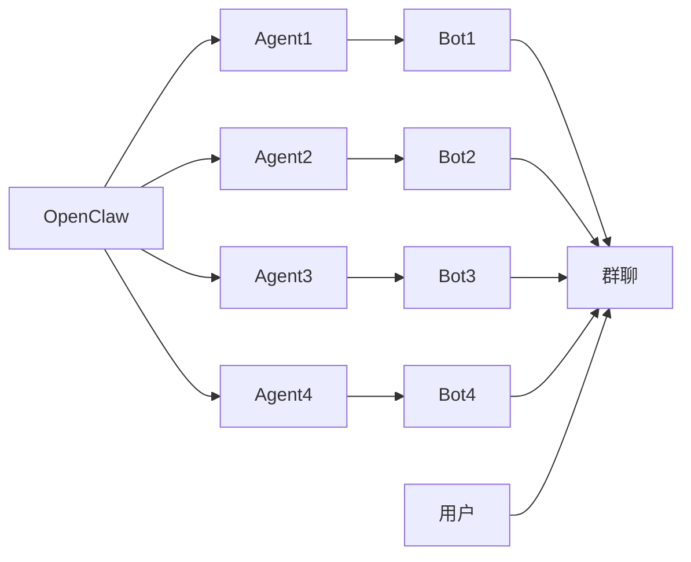

# OpenClaw Feishu Channel - 多 Agent 自主协作的飞书通道

<p align="center">
  
  
  
</p>

## 🌟 核心亮点

这是 **OpenClaw** 平台的飞书（Feishu/Lark）通道插件，它的最大创新在于：

> **支持多 Agent 自主协作 -- 让飞书机器人之间可以相互 @ 和分工协作**

传统的聊天机器人平台（包括官方方案）通常有以下限制：
- ❌ 一个群聊里只能有一个机器人在运行
- ❌ 机器人无法识别和调用其他机器人
- ❌ 用户需要手动选择@哪个机器人

**本方案打破了这些限制：**
- ✅ **机器人 @ 机器人**：Agent 可以在回复中@其他机器人，实现协作
- ✅ **自动消息路由**：根据@关键词自动将消息转发给目标 Agent
- ✅ **分工协作**：不同 Agent 负责不同领域，自动协同工作
- ✅ **统一入口**：用户只需@一个入口机器人，由它协调其他专业 Agent

---

## 🏗️ 架构设计



**核心流程：**
1. 用户@入口机器人 → OpenClaw 入口 Agent 处理
2. 入口 Agent 分析后@技术专家 → 消息路由中间件拦截
3. 路由到技术 Agent → 技术 Agent 独立处理
4. 技术 Bot 用自己的身份回复用户

> 💡 **查看完整架构图**：参见 [ARCHITECTURE.md](./ARCHITECTURE.md)

---

## 🚀 快速开始

### 1. 安装插件

```bash
# 将插件放入 OpenClaw 扩展目录
cp -r feishu /root/.openclaw/extensions/

# 重启 OpenClaw Gateway
openclaw gateway restart
```

### 2. 配置飞书应用

在 `openclaw.json` 中配置飞书通道：

```json
{
  "channels": {
    "feishu": {
      "enabled": true,
      "appId": "cli_xxxxxxxxxxxxxxxx",
      "appSecret": "xxxxxxxxxxxxxxxxxxxxxxxxxxxxxxxx",
      "encryptKey": "xxxxxxxxxxxxxxxx",
      "verificationToken": "xxxxxxxxxxxxxxxx",
      "domain": "feishu",
      "connectionMode": "webhook",
      "webhookPath": "/webhook/feishu",
      "webhookPort": 3000
    }
  }
}
```

### 3. 配置多 Agent 路由

在 `plugins.entries.feishu.config.router` 中配置路由：

```json
{
  "plugins": {
    "entries": {
      "feishu": {
        "enabled": true,
        "config": {
          "router": {
            "enabled": true,
            "senderMentionKey": "@_user_1",
            "senderOpenId": "ou_xxxxxxxxxxxxxxxx",
            "routes": {
              "miloRouter": {
                "isRouter": true,
                "accountId": "milo",
                "botOpenId": "ou_xxxxxxxxxxxxxxxx",
                "botName": "智能助手-milo",
                "aliases": ["milo", "助手"]
              },
              "techRouter": {
                "accountId": "product-tech",
                "botOpenId": "ou_xxxxxxxxxxxxxxxx",
                "botName": "技术专家",
                "aliases": ["tech", "技术", "开发"]
              },
              "healthRouter": {
                "accountId": "health-advisor",
                "botOpenId": "ou_xxxxxxxxxxxxxxxx",
                "botName": "健康顾问",
                "aliases": ["health", "健康", "医疗"]
              },
              "marketingRouter": {
                "accountId": "marketing",
                "botOpenId": "ou_xxxxxxxxxxxxxxxx",
                "botName": "营销专家",
                "aliases": ["marketing", "营销", "市场"]
              }
            }
          }
        }
      }
    }
  }
}
```

### 4. 绑定 Agent

将飞书账户绑定到 OpenClaw Agent：

```json
{
  "bindings": [
    {
      "agentId": "milo",
      "match": {
        "channel": "feishu",
        "accountId": "milo"
      }
    },
    {
      "agentId": "tech-expert",
      "match": {
        "channel": "feishu",
        "accountId": "product-tech"
      }
    }
  ]
}
```

---

## ⚙️ 配置详解

### Router 配置参数

| 参数 | 类型 | 说明 |
|------|------|------|
| `enabled` | boolean | 是否启用路由功能 |
| `senderMentionKey` | string | 发送者 Mention 占位符，默认 `@_user_1` |
| `senderOpenId` | string | 发送者 OpenID，用于构造消息身份 |
| `routes` | object | 路由目标定义 |

### Route Target 参数

| 参数 | 类型 | 说明 |
|------|------|------|
| `isRouter` | boolean | 是否为入口路由器（只能有一个） |
| `accountId` | string | 飞书账户 ID |
| `botOpenId` | string | Bot 的 OpenID |
| `botName` | string | Bot 显示名称 |
| `aliases` | string[] | 触发路由的别名列表 |

### 工作原理

1. **消息拦截**：当入口机器人（`isRouter=true`）生成回复时，检查是否包含 `@别名`
2. **目标匹配**：根据 `aliases` 匹配找到目标 Agent
3. **消息路由**：通过 `session_send` 将消息发送到目标 Agent 的会话
4. **独立回复**：目标 Agent 用自己的身份独立回复，不经过原机器人

---

## 💡 使用场景

### 场景 1：智能客服分流

```
用户：@智能客服 我的服务器连不上了

智能客服（Router）：这是技术问题，@技术专家 你来处理一下

技术专家：我来帮您排查，请提供以下信息...
```

### 场景 2：多领域协作

```
用户：@智能助手 我想做一个健康类 App，需要技术和营销建议

智能助手（Router）：好的，这个问题涉及多个领域：
  @技术专家 请评估技术方案
  @营销专家 请提供市场推广建议

技术专家：从技术角度，建议采用...

营销专家：从营销角度，建议先...
```

### 场景 3：工作流自动化

```
用户：@项目助理 创建一个新的产品需求

项目助理（Router）：已收到需求，正在协调相关角色：
  @产品经理 请创建 PRD
  @设计师 请准备原型图
  @开发组长 请评估工期

产品经理：收到，今天下班前提供 PRD...
```

---

## 🔧 高级功能

### 消息格式支持

支持文本消息和卡片消息的路由：

```typescript
// 文本消息
@技术专家 这个问题需要你来看看

// 卡片消息（富文本）
{
  "config": { "wide_screen_mode": true },
  "elements": [
    { "tag": "div", "text": { "tag": "lark_md", "content": "@技术专家 请处理" } }
  ]
}
```

### 多目标路由

一条消息可以同时路由给多个 Agent：

```
@技术专家 @产品经理 这个需求需要你们一起评审
```

### 上下文保持

路由消息会携带原始上下文（chatId、senderOpenId 等），确保目标 Agent 能正确回复到原群聊。

---

## 📁 项目结构

```
feishu/
├── src/
│   ├── channel.ts          # 飞书通道主入口
│   ├── router-middleware.ts # 消息路由中间件（核心）
│   ├── router-config.ts     # 路由配置 Schema
│   ├── bot.ts              # Bot 消息分发
│   ├── send.ts             # 消息发送
│   ├── mention.ts          # @提及处理
│   ├── accounts.ts         # 账户管理
│   ├── client.ts           # Feishu API 客户端
│   ├── outbound.ts         # 消息外发
│   ├── policy.ts           # 群组策略
│   └── ...                 # 其他功能模块
├── skills/                 # 技能目录
│   ├── feishu-doc/         # 飞书文档操作
│   ├── feishu-wiki/        # 飞书知识库
│   ├── feishu-drive/       # 飞书云盘
│   └── feishu-perm/        # 飞书权限管理
├── index.ts                # 插件入口
├── openclaw.plugin.json    # 插件配置
└── README.md               # 本文件
```

---

## 🔐 权限配置

飞书应用需要以下权限：

- `im:message:send_as_bot` - 以 Bot 身份发送消息
- `im:message.group_msg` - 读取群消息
- `im:chat:readonly` - 读取群信息
- `im:resource` - 获取消息资源（图片、文件等）
- `contact:user.emp_id:readonly` - 读取用户 employee_id
- `contact:user.base:readonly` - 读取用户基本信息

---

## 🐛 故障排查

### 路由不生效

1. 检查 `router.enabled` 是否为 `true`
2. 检查入口机器人的 `isRouter` 是否为 `true`
3. 检查 `aliases` 配置是否正确
4. 查看日志：`[Router]` 开头的日志信息

### 消息发送失败

1. 检查飞书应用的权限是否已授权
2. 检查 `appId` 和 `appSecret` 是否正确
3. 检查 Bot 是否已添加到群聊

### 目标 Agent 未回复

1. 检查 Agent 是否已正确绑定到飞书账户
2. 检查目标 Agent 的状态是否正常
3. 查看目标 Agent 的会话日志

---

## 🤝 与其他方案对比

| 特性 | 官方方案 | 本方案 |
|------|---------|--------|
| 机器人 @ 机器人 | ❌ 不支持 | ✅ 支持 |
| 多 Agent 协作 | ❌ 不支持 | ✅ 支持 |
| 自动路由 | ❌ 不支持 | ✅ 支持 |
| 分工协作 | ❌ 不支持 | ✅ 支持 |
| 上下文保持 | ⚠️ 部分支持 | ✅ 完整支持 |
| 消息格式 | 仅文本 | 文本+卡片 |

---

## 📝 更新日志

### v1.0.0
- 初始版本发布
- 支持飞书消息收发
- 支持多 Agent 消息路由
- 支持文本和卡片消息
- 支持上下文保持

---

## 📄 许可证

MIT License - 详见 LICENSE 文件

---

## 🤝 贡献

欢迎提交 Issue 和 PR！

---

## 🔗 相关链接

- [OpenClaw 官方文档](https://docs.openclaw.ai)
- [飞书开放平台](https://open.feishu.cn)
- [Lark 开放平台](https://open.larksuite.com)

---

<p align="center">
  让 AI Agents 在飞书中自由协作 🤖💬🤖
</p>
